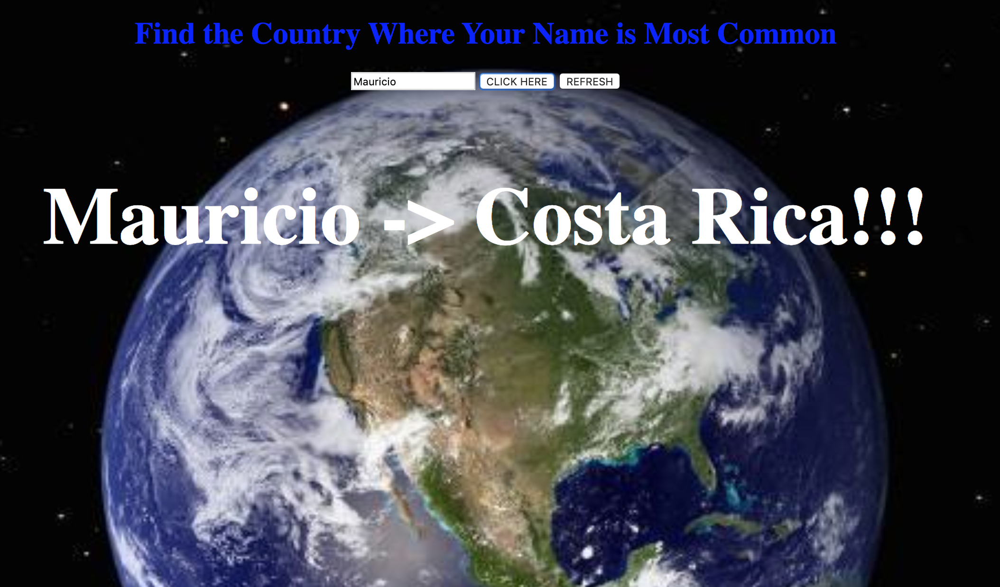

# 📊 Project: Complex API 2

### Goal: Use data returned from one api to make a request to another api and display the data returned

### In this application I am tacking in a Users name and giving the the country where the name is most common.  I sued two different API one for name to Country Code.  Then I used a secondary API in order to convert the country code into actual country name:

### Click to find where your name is most common: https://upbeat-lamarr-e759bd.netlify.com/



Tech Used:
- HTML5
- CSS
- Javascript
- API for names to country
- API for county code to country name
```
