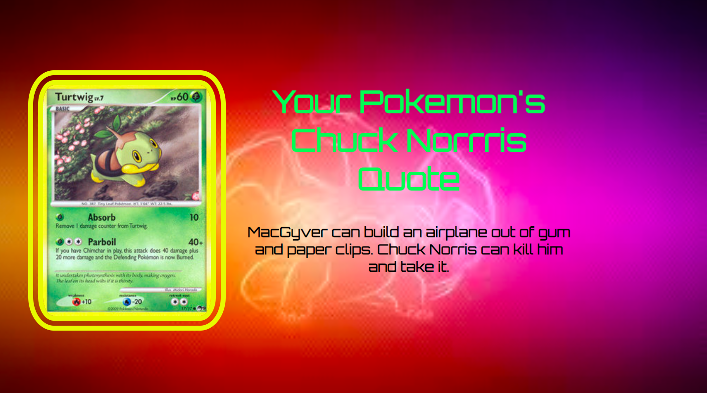

# 📊 Project: Complex API 2

### Goal: Use data returned from one api to make a request to another api and display the data returned

# 📊 Project: Simple API 1

### Goal: Display data returned from an api

# Technology Used:
### HTML, Javascript, Css, API

# Optimizations:
### insert a number from 1-100 and a random pokemon and Chuck Norris quote will appear.
