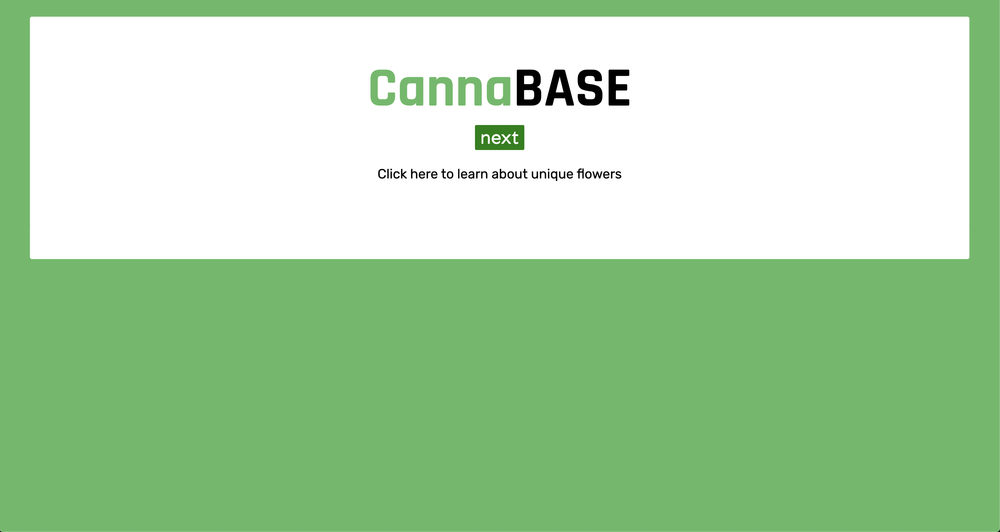
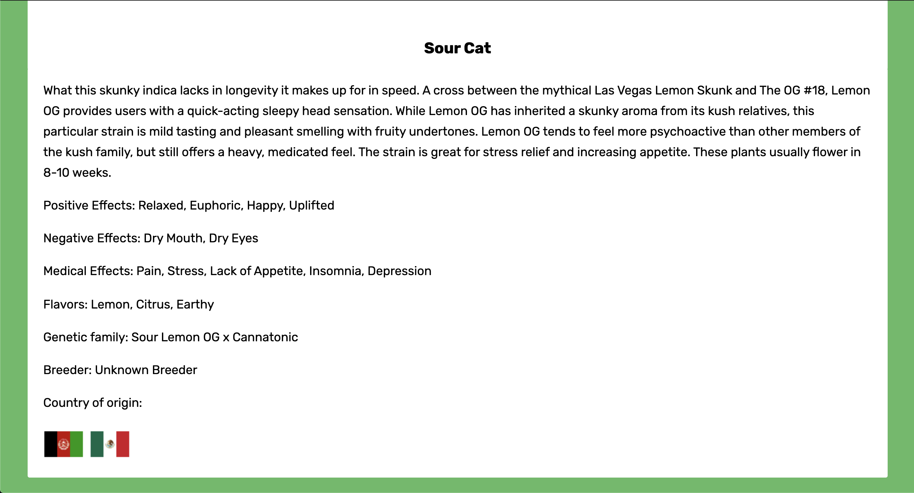

# Complex API 2: CannaBase
#### Project Scope: CannaBase randomly displays a cannabis profile that displays key descriptions and lineage. It incorporates two different cannabis APIs by Otreeba and The Strain and a flag API to represent country of origin. 
#### View here: https://svdev-cannabase.netlify.com

# How it was made:
#### HTML5, CSS3, Javascript E6, API, JSON

# Optimizations:
#### This API feeds one API into a flag API to display country of origin and a separate cannabis API to display the description, effects and flavors. 

# Lesson Learned: 
#### To develop a cohesive app with utility, it is important to take into account the information available in each API. 

# Sources:
#### Otreeba Open Cannabis API: https://api.otreeba.com/swagger/
#### The Strain API: https://strains.evanbusse.com/
