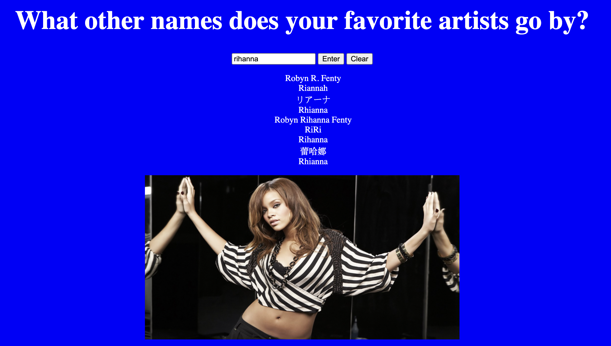

# 📊 Project: Complex API 2

### Goal: Use data returned from one api to make a request to another api and display the data returned

### I used two api's to create an app where you can enter your favorite artist and find out their nicknames and see a photo of them as well

[Checkout My Portfolio](https://www.tamikasterlin.com)

