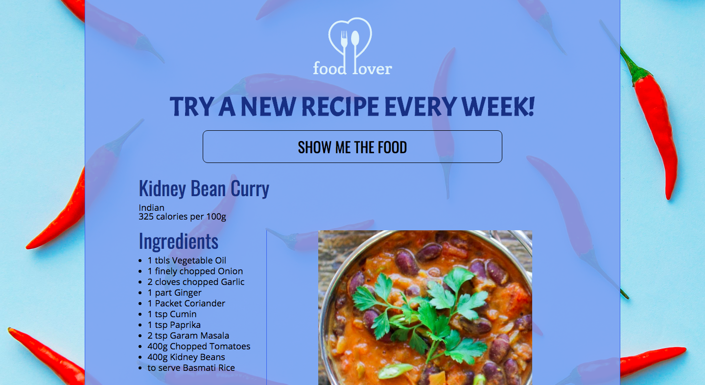

# 📊 Project: Complex API 2

### Goal: Get a randomized recipe and display using The Meal DB's API. From the recipe given, get the number of calories per 100g of that dish and using Edamam's Food Database API.

**View project in browser:** endev-recipe-complex-api

## Design and Development:
**Tech Used** HTML, CSS, JavaScript, API, JSON: 
Using The Meal's DB to get a randomized recipe, take the recipe name and fetch Edamam's Food Database API to get number of calories per 100g for that meal.

## Reflections:
The Meal DB's API was a different from other APIs that list their ingredients in an array. Their ingredients AND measurements are listed as separate keys: "strIngredient1" "strMeasure1" through 20. Initially, I was going to use Edamam's API to get nutrient facts on individal ingredients but ended up using the name instead. Because I thought I would be getting info for each ingredient, that explains the getIngredients function rather than displaying: <strMeasure1 + " " + strIngredient1>.

## API Source:
**The Meal DB:** https://www.themealdb.com/api.php

**Edamam Food Database:** https://developer.edamam.com/food-database-api
