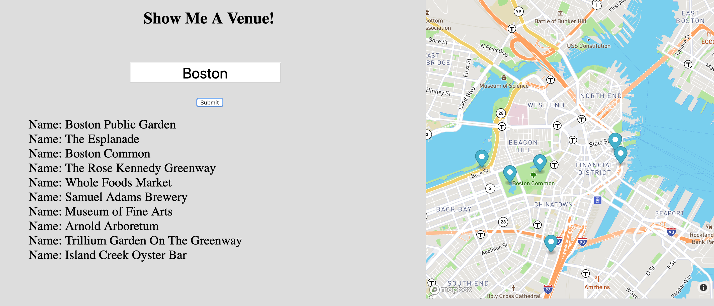

# Map Venue
This project is utilizing a mapbox api, as well as a foursquare api. The user inputs a city where the foursquare api then targets the mapbox api and shoots out all venues the user requested. There is a marker pointing to the exact latitude and longitude.

**Tech used:** HTML, CSS, & JavaScript

## Lessons Learned:

This project was an interesting one. A fetch approach was not needed to target the mapbox api but instead, the map was designed through the html that connected directly through to the mapbox website itself. It was fun to use the foursquare api where I incerted all the venues through a div placeholder instead of an ul which was what I am used to doing.

