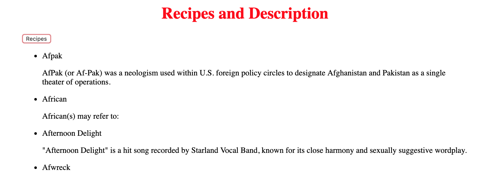

# My Awesome Project
In this application the user can press a button and get different strains of weed and their wiki description.

## How It's Made:

**Tech used:** HTML, CSS, JavaScript, Framework of choice

In this project I used an API that looked had a list of strains of weed. The strains of weed are then looked up on wiki. I used a loop to go through the objects properties.

## Lessons Learned:

I learned somewhat how to go through the properties of the objects in an array from an API.

