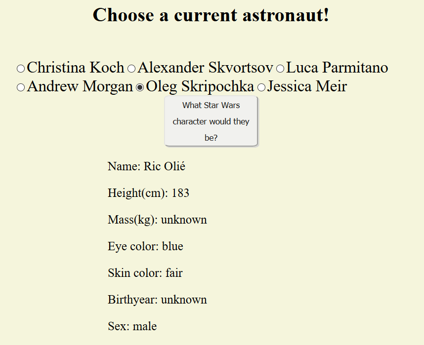

# 📊 Project: Complex API 2
link: https://hardcore-easley-915bde.netlify.com/

### Goal: Use data returned from one api to make a request to another api and display the data returned

### How I did it:

- Technologies used: HTML, CSS, JS
- The initial rendering has a button with an event listener
- Upon being clicked, a function runs to take gather the names of the astronauts currently on the ISS
- The names are added to some input nodes and they're allcollectively appended to a form that is hidden
- One of the radio button inputs must be selected and the next button pressed to call the next API
- The selected astronaut name is taken and split up, the initials of the astronaut are taken and used to query a Star Wars API
- The first index returned character object is taken and its information is displayed by taking each property and appending it to p elements in the DOM
 
