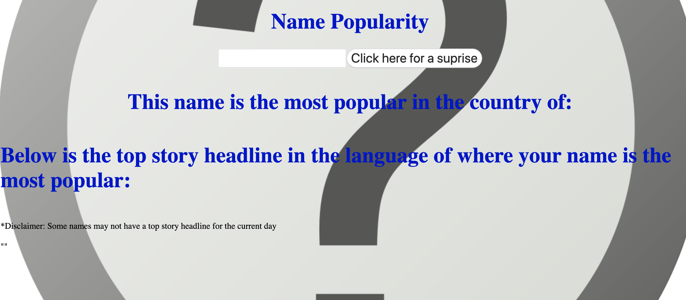

Top Headlines Based on Origin of Name Popularity 

User is able to insert name and receive the country where their name is the most popular. Based on the country, a top headline will appear relating to an event in that country.

This was created with HTML,CSS, Javascript, Nationalize and NewsAPI's API.

View Here: https://amazing-lamarr-93c6ac.netlify.com/

