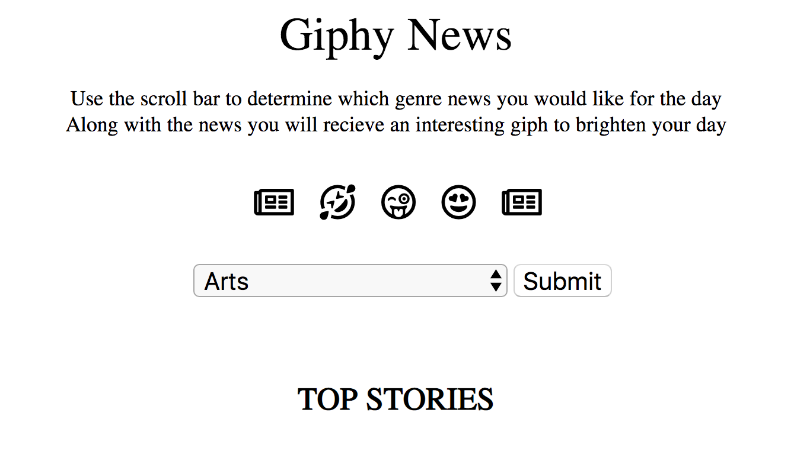
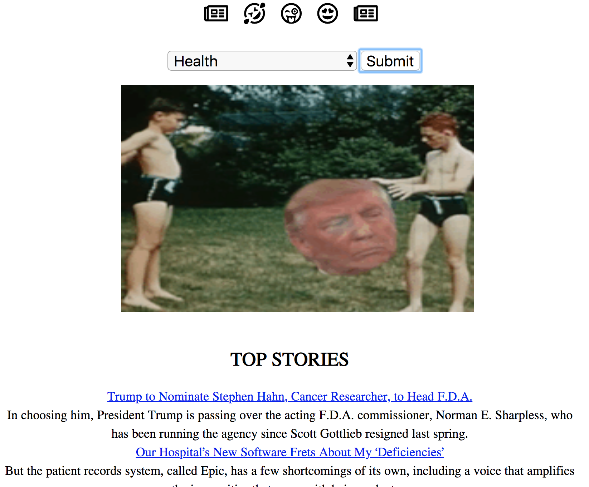

# 📊 Project: Complex API 2

### Goal: Use data returned from one api to make a request to another api and display the data returned

* **Project Title: Giphy News**
  - "Giphy News" is a webpage that shows you the top news story for that given day as well as a funny giph.

* **Overview**
  - It pulls data from two API's. It receives 5 news articles including a mini description of each from NYT's API, as well as giphs from giphs' API.
  - This page was created for the person that loves to start their day either watching the news or online reading articles. Most times when we tune into the news it can leave us feeling upset, or sad. The way this webpage helps to counteract that is by giving you a giph alongside the top news articles of that day. So no matter what the news throws at you on that given day you'll have some humor/ or creativity to start your day with.

* **link to project**: https://eager-tesla-43727a.netlify.com

* **Image of project**

* **Image of project in use**

* **Getting Started**
  - Click on the link above
  - Choose the news genre you wish to view(ex: history, fashion, travel)
  - Enjoy! click on the news articles name's to view the entire story :)
